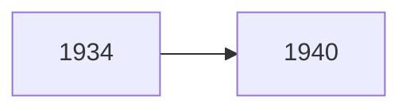

# Wood Book 356 - 364: Mexico
## Political and Economic Change
 - Mexican history starts in 1821 after it gained independence.
 - Military dictatorship in the 19th century.
 - Violence in the early 20th century.
<br>
 - Mexio's economy was mostly based on agriculture.
 - Mexico was strongly influenced by industrialization.

### Colonialism

During this period, Mexico was a Spanish colony.
 - **Cultural heterogenity**
 - **Catholicism**
 - **Economic dependency**
### Independence

A Mexican priesr names Miguel Hidalgo led a rebellion against Spanish rule in 1810. In 1821, Spain gave Mexico independence. Stability and order did not follow.

 - **Instability and legitimacy issues**
 - **Rise of the military**
 - **Domination by the United States** --- Mexico lost half of its territory to the U.S. by 1855.
 - **Liberal vs. conservative struggle** --- Constitution of 1857 set up a democracy. Benito Juarez, a liberal president, was a hero to Mexico. Conservatism was reflected in the joint Spanish, French, and English takeover under Maximillian.

 ### The "Porfiriato"
 ```mermaid
 graph LR
 1876 --> 1911
 ```
 **Porfiriato Diaz**, one of Juarez's generals, staged a coup in 1876 and became the president. He said he would serve one term, but ended up serving for 34 years. He brought with him the *cientificos*, a group of young advisors who sought to being scientific and economic growth to Mexico.
  - **Stability**
  - **Authoritarianism**
  - **Foreign investment and economic growth**
  - **Growing gap between the rich and the poor** --- Mexico's growing wealth did not benefit the poor as much as the elites.

### 1910 - Present

The revolution of 1910 was a coup from within the elite. Another round of instability and disorder followed.
#### The Chaos of the Early 20$^{th}$ Century
 - Revolution by elites to remove Diaz.
 - **Patron-Clientelism** --- In order to overthrow Diaz, **caudillos**, political strongmen from different areas, rose the challenge each other. **Emiliano Zapata** and **Pancho Villa** emerged and a Patron-Clientel system arose around each.
 - **Constitution of 1917** --- It was the end of the revolution but not the violence.
 - **Conflict with Catholic Church** --- The Cristero Rebellion in 1920 was one of the bloodiest in Mexcian history. Liberals saw the church as a bastion of conservatism. They set up laws that forbid the influence of the church in any way.
 - **The establishment of PRI** --- PRI is a party coalition that institutionalized the revolution. They passed around the presidency in six year terms, called **sexenio**.
#### The Cardenas Upheaval

**Lazaro Cardenas** began a remarkable sexenio that stabilized and radicalized Mexcian politics. Cardenas gave a voice to the peasant demands.
 - **Redistribution of Land** --- Land was taken from elites and given to peasants as ***ejidos***, collective land grants.
 - **Nationalization of industry** --- **PEMEX**, a government controlled oil company, was created.
 - **Investment in public works**
 - **Encouragement of peasant and union organizations**
 - **Concentration of power in the presidency**
 - **Import substitution industrialization** --- A method of state led development. ISI puts high tarrifs to protect local goods. The government owns key industries.
 - **State Corporatism**

#### The Emergence of the *Technicos* and the Pendulum Theory
- Miguel Aleman became president and set Pendulum Theory into place.
- He rejected some of Cardenas' changes and implemented  economic liberalization. He was followed by someone who re-implemented Cardenas' changes, creating a back and forth effect. ***Technicos***, educated, business oriented leaders, gained power. By the 1980s, Mexico practiced **neo-liberalism**. Mexico's GNP grew until the early 1980s. This was known as the **Mexican Miracle**.
