# Iran Least You Need To Know
## General Information About Iran

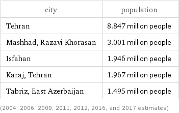
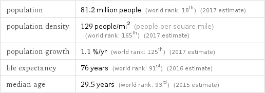
## People
### Mohammed Mossadegh
#### Basic Information
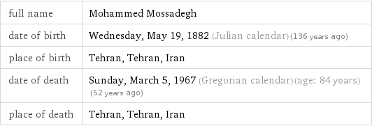
Mohammad Mosaddegh (16 June 1882 - 5 March 1967) was the 35th prime minister of Iran, holding office from 1951 until 1953, when his government was overthrown in a coup d'état orchestrated by the United States' Central Intelligence Agency and the United Kingdom's MI6.
#### Leadership

___
#### Notable Facts
 - Prime Minister of Iran for two years until his 1953 overthrow in a coup organized by the United States Central Intelligence Agency

 - Nationalized the Iranian oil industry, previously controlled by Great Britain, and introduced progressive social reforms
___
### Ayatollah Ruhollah Khomeini
#### Basic Information

Sayyid Ruhollah Mūsavi Khomeini (24 September 1902 - 3 June 1989), known in the Western world as Ayatollah Khomeini, was an Iranian politician and marja. He was the founder of the Islamic Republic of Iran and the leader of the 1979 Iranian Revolution that saw the overthrow of the last Shah of Iran.
#### Leadership

___
#### Notable Facts
 - Grand Ayatollah and leader of 1979 Iranian Revolution which deposed the Shah, and became Supreme Leader, the highest ranking political and religious authority
 - Issued a fatwa in 1989 calling for the death of British citizen Salman Rushdie for blasphemy of his novel The Satanic Verses
 - Supported hostage takers during the 1979 hostage crisis when 66 Americans were held by Islamic students and militants for 444 days
 - Returned to Iran from exile in 1979, welcomed by a crowd of millions, and claimed authority in opposition to the Shapour Bakhtiar's provisional government
 - Prior to the Iranian Revolution spent more than 14 years in exile, mostly in the holy Shia city of Najaf, Iraq
 - As a marja in Twelver Shi'a Islam, advocated expanding the role of clerical authority to include governing by theocracy of Islamic jurists
 - Iraq's 1980 invasion rallied Iranians behind Khomeini's regime and allowed him to consolidate and stabilize his leadership
___
### Ayatollah Ali Khamenei
#### Basic Information

Sayyid Ali Hosseini Khamenei (born 17 July 1939) is a marja and the second and current Supreme Leader of Iran, in office since 1989. He was previously President of Iran from 1981 to 1989. Khamenei is the second-longest serving head of state in the Middle East (after Oman's Sultan Qaboos), as well as the second-longest serving Iranian leader of the last century, after Shah Mohammed Reza Pahlavi.
#### Leadership

___
#### Notable Facts
 - Iranian politician known as one of three people considered to have had important influences on the Islamic Republic of Iran
 - Supported the re-election of Mahmoud Ahmadinejad amidst the protests following the 2009 presidential elections
 - Victim of assassination attack which left his right arm paralyzed for life
 - Imprisoned intellectual dissenters and had riot police attack protesters in Tehran in 2010
___
### Mohammad Khatami
#### General Information

Seyyed Mohammad Khatami (born 14 October 1943) is an Iranian scholar, Shia theologian, and reformist politician. He served as the fifth President of Iran from 3 August 1997 to 3 August 2005. He also served as Iran's Minister of Culture from 1982 to 1992. He was an outspoken critic of former President Mahmoud Ahmadinejad's government.
#### Leadership

___
#### Notable Facts
 - Scholar and politician who served as the President of Iran and became one of the leader's of the country's Green Movement
 - Proposed a Dialogue Among Civilizations, which the United Nations adopted as a theme for the year 2001
 - Promoted liberalization of foreign and domestic policy as President of Iran
 - Served as Minister of Culture in the 1980s and 1990s
___
### Mahmoud Ahmadinejad
#### Basic Information
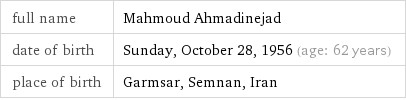
Mahmoud Ahmadinejad (born Mahmoud Sabbaghian on 28 October 1956) is an Iranian politician who was the sixth President of Iran from 2005 to 2013. He was also the main political leader of the Alliance of Builders of Islamic Iran, a coalition of conservative political groups in the country.
#### Leadership
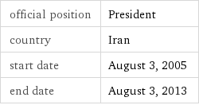
___
#### Notable Facts
 - Former President of the Islamic Republic of Iran, a controversial figure both within and outside of Iran for his economic weaknesses and perceived disregard for human rights
 - Disputed election to a second presidential term in 2009 led to domestic protests and attracted international criticism
 - Primary political leader of the Alliance of Builders of Islamic Iran, a coalition of conservative political groups
 - As mayor of Tehran, took a religious hard-line, undoing the reforms of previous, more moderate mayors
 - Enacted a gas rationing plan to reduce the Islamic Republic of Iran's fuel consumption, and supports the country's nuclear energy program
 - Cut the allowable interest rates for public and private banking facilities
 ___
### Mir-Hossein Mousavi
#### Basic Information

Mir-Hossein Mousavi Khameneh (born 2 March 1942) is an Iranian reformist politician, artist and architect who served as the seventy-ninth and last Prime Minister of Iran from 1981 to 1989. He was a reformist candidate for the 2009 presidential election and eventually the leader of the opposition in the post-election unrest. Mousavi served as the president of the Iranian Academy of Arts until 2009, when Conservative authorities removed him.
#### Leadership

___
#### Notable Facts
 - Politician who was the last Prime Minister of Iran and later the leader of the Green Movement
 - Ran against President Mahmoud Ahmadinejad in the 2009 elections, and became leader of the opposition in the following unrest
 - Began his term as prime minister in 1981, which ended when 1989 constitutional reforms abolished the post
 - Artist and architect who was President of the Iranian Academy of Arts until he was removed by Conservative authorities in 2009
 - Served as editor-in-chief of the Islamic Republican Newspaper before becoming Minister of Foreign Affairs
## History
### Safavids
#### Time Period

#### Basic Information
 The Safavid dynasty was one of the most significant ruling dynasties of Iran, often considered the beginning of modern Iranian history. The Safavid shahs ruled over one of the Gunpowder Empires. They ruled one of the greatest Iranian empires after the 7th-century Muslim conquest of Iran.
___
#### Introduction of Shi'ism
The Safavid dynasty established the Twelver school of Shia Islam as the official religion of the empire, marking one of the most important turning points in Muslim history.
### Qajars
#### Time Period

#### Basic Information
The Qajar dynasty was an Iranian royal dynasty of Turkic origin, specifically from the Qajar tribe, which ruled Persia (Iran) from 1794 to 1925. The state ruled by the dynasty was officially known as the Sublime State of Persia. The Qajar family took full control of Iran in 1794, deposing Lotf 'Ali Khan.

#### Constitution of 1906
The Persia Constitution of 1906 was the first constitution of Persia (Iran) that resulted from the Persian Constitutional Revolution and it was written by Hassan Pirnia, Hossein Pirnia, and Ismail Mumtaz, among others. It divides into five chapters with many articles that developed over several years. The Belgian constitution, like the constitutions of other European states, served as a partial model for the Iranian constitution.

#### Tehran
Qajar king Agha Mohammad Khan chose Tehran as the capital of Iran in 1786.

#### Secularization
The consititution of 1906 secularized the government and religion.

### Pahlavis
#### Time Period

#### 1953 CIA & UK Financed Coup
The 1953 CIA & UK financed coup was an overthrow on the Iranian president Mohammad Mossadegh. They organized the coup after Mohammad Mossadegh announced his plans to nationalize the state's oil industry
#### 1941 Abdication of Shah Reza Khan
In 1941 Shah Reza Khan he was forced to abdicate by the Allies after the Anglo-Soviet invasion of Iran. He was succeeded by his son, Mohammad Reza Pahlavi, the last Shah of Iran.
#### White Revolution
The White Revolution, or the Shah and People Revolution, was a far-reaching series of reforms in Iran launched in 1963 by Shah Mohammad Reza Pahlavi and lasted until 1979. It consisted of several elements, including:
 - Land reform
 - Sale of some state-owned factories to finance this land reform
 - Construction of an expanded road, rail, and air network
 - A number of dam and irrigation projects
 - The encouragement and support of industrial growth
 - Enfranchisement of women
#### Industrialization
Reza Shah improved the country's overall infrastrucutre, implemented educational reform, campaigned against foreign influence, reformed the legal system, and introduced modern industries. In the interwar period, modern industries were introduced. Whereas fewer than 20 modern industrial plants existed in 1925, by 1941 more than 800 new plants had been established.
#### Westernization & Secularization
The White Revolution introduced reforms like secularization and westernization.
#### Resurgence Party
In 1975, Muhammad Reza Shah created the resurgence party and declared Iran to be a one party state with him as its head. He replaced the islamic calendar with a new one. He also instated religious corps to tach peasants "true islam".
#### SAVAK
The SAVAK was the secret police, domestic security and intelligence service in Iran during the Pahlavi period.
#### OPEC
The Organization of the Petroleum Exporting Countries is an intergovernmental organization founded in 1960 in Baghdad by the first five members (Iran, Iraq, Kuwait, Saudi Arabia, and Venezuela). It accounts for 44.5% of all oil production
### Islamic Revolution of 1979
The Islamic Revolution of 1979 was very unique because it was entirely religious. The people overthrew the Shah because of his ties to the west and his fast paced secularization of the government. The revolution was headed by [Ayatollah Khomeini](#ayatollah-ruhollah-khomeini) who became the next leader of Iran
#### Revolution of Rising Expectations
The theory of the revolution of rising expectations states that revolution is more likely to occur when people are doing better than they once were, but some type of setback happens.

### Hostage Crisis
The Iran Hostage Crisis was a diplomatic standoff between Iran and the United States of America. Fifty-two American diplomats and citizens were held hostage for 444 days from november 4, 1979, to January 20, 1981.
### Cultural Revolution
The Cultural Revolution in Iran aimed to purify the country from the shah's regime and secular values and western ideas.
#### Comparison With China
The Cultural Revolution in iran had very similar motives to Mao Zedong's Cultural Revolution. They both seeked to "purify" the country.
### Khatami
See [Muhammad Khatami](#muhammad-khatami)
#### Tehran Spring
The Tehran Spring was a period under the presidency of Muhammad Khatami when cautious economic liberalization occured, with a loosening of freedom of speech and press, a more open economy, and a friendlier stance towards the outside world. When Mahmoud Ahmadinejad became the president in 2005, the government closed down newspapers, banned and censored books, and did not tolerate peaceful protests.
## System of Government

### Unitary System
Iran is a Unitary system. This means that the main or central government holds all of the power. In Iran's case, the supreme leader holds all of the power.
### Theocracy
Iran has a theocracy which means that they accept religious figures as their supreme leader. In this case, the supreme leader is an interpreter of islam law.
### Jurist Guardianship
Jurist Guardianship gave the senior clergy power over the unfortunate people. However, after the 1979 Revolution, Ayatollah Khomeini declared that it gave the senior clergy (himself) authority over all of the Shia community.
#### *velayet -e faqih*
Another term for Jurist Guardianship.
## Legitimacy

### Constitution of 1979
The Constitution of 1979 replace the Constitution of 1906. The constitution has been called a "hybrid" of "theocratic and democratic elements". While articles One and Two vest sovereignty in God, article six "mandates popular elections for the presidency and the Majlis, or parliament."
### Religion
The government follows sharia islamic law. It is ruled by religious leadership.
### Democratic Elements
The aftermath of the 1979 revolution meant to combine democratic involvement with theocratic oversight. Iran has a few democratic elements. They have an elected president and parliament. However, they still have an unelected supreme leader
## Cleavages

### Religion
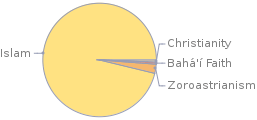
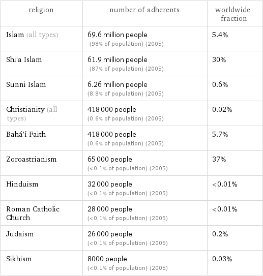
#### Sunni
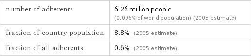
#### Shi'ism

#### Zoroastrianism
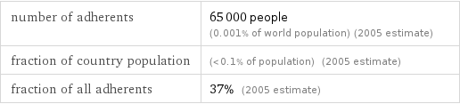
#### Judaism
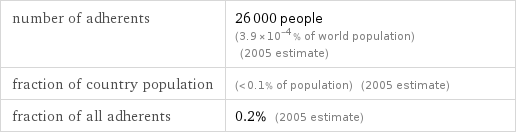
#### Christian

### Ethnicity

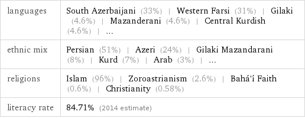
#### Azeris
Many Azeris live in the northwest close to the former Soviet republic of Azerbaijan, creating a worry for the Iranain government that the Azeris will want to form a larger state and take land from Iran.
## Economic Policy

### Statists vs Free-Marketers
#### Statists
Statists in Iran belive the government should take an active role in controlling the economy. The government should have powers and responsiblilites such as:
 - Redistributing land and wealth
 - Eliminating Unemployment
 - Financing social welfare programs
#### Free-Marketers
Free-Marketers in Iran want to:
- Remove price controls
- Lower business taxes
- Encouage private enterprise
- Balance the Budget
- Use Western principles in the economy
### Rentier State
A rentier economy is heavily supported by the state expenditure, while the state recieves rent from other countires. Iran was transformed into a rentier state under the Pahlavis because of the increasing oil income. Iran recieved an increasing amount of income by exporting its oil and leasing oil fields to foreign countires.
### Import Substitution Idustrialization
Encourages domestic industries to provide products that the population needs. Under the Pahlavis, President Mossadegh adopted this practice to boost the state's oil industry.
### Impact of Sanctions on Iran
United States President Donald Trump withdrew the United States from the JCPOA and to re-impose U.S. sanctions on Iran that had been suspended under the JCPOA agreement. The impact of the sanctions caused the Iranian oil production and GDP to fall. Iran's currency is weakening, and inflation is picking up.
## Government Institutions

### Supreme Leader
The position at the top of Iran's government was meant to be filled by Ayatollah Khomeini, the leader of the 1979 Revolution. The supreme leader is the imam of the whole community, and he represents the pinnacle of theocratic principles of the state. The supreme leader is the main *faqih*, or interpreter of sharia law. The Supreme leader can also vet elected candidates, declare war and peace, and appoint major administrators.
### President
The president is the chief executive and the highest state official after the supreme leader. He is directly elected every four years by iranian citizens, and he is limited to two consecutive terms in office. The president in the head of government, while the supreme leader is the head of state. Although he is democratically elected, the Constitution requires him to be a pious Shiite. Some of the president's powers include:
 - Devising the budget
 - Supervising economic matters
 - Proposing legislation to the Majiles
 - Executing policies
 - Signing of treaties, laws, and agreements
 - Chairing the National Security council
 - Selecting vice presidents and cabinet members
 - Appointing provinical governors, town mayors, and ambassadors
### Cabinet & Bureaucracy
The president heads a huge bureaucracy that has expanded to provide jobs for college students. It has doubled since 1979, and includes:
 - Culture and Islamic Guidance that censors the media
 - Intelligence that serves as the chief security organization
 - Heavy Industry that guides that manages nationalized factories.
The clergy dominates the bureaucracy and the presidency.
### Majiles
The Majiles first came to be in 1906 after the Constitutional Revolution. It was a part of Iran's early experiments with democracy.
#### Pahlavis
Although they can technically act independently, The Majiles acted as a rubber stamp legislature that let the shah do as they pleased.
#### Modern Times
The Majiles have a weakened relationship with the presidency. However, the Majiles still remain as the main legislation of Iran. Some of the Majiles' powers include:
 - Enacting or changing laws
 - Interpreting legislation
 - Appointing six of the twelve members of the Guardian Council
 - Investigating cabinet members.
 - Removing cabinet members
 - Approving the budget
### Guardian Council
The Guardian Coucnil is another theocratic body in Iranian government. Six are appointed by the supreme leader, and the other are nominated by the chief judge and approved by the Majiles. Bills passed by the Majiles are checked by the guardian council to see if they follow sharia law.
### Expediency Council
Because the Guardian Council and can overturn the laws made by the Majiles, they often argue fiercly. The Expediency Council referees their disputes. It orignially consisted of 13 clerics. Over time, it grew to 32 members with much more power than it used to have. For example, it can originate its own legislature.
### Assembly of Religious Experts
The assembly of religious experts is an 86-man house that is directly elected by the people every four years. The assembly, along with the supreme leader and the guardian council, broadly interpret the constitution.
### Judiciary
#### Pahlavis
Unlike most of Iran's government institutions, the Judiciary was completely secularized from the government. They had a European style judicial system and law codes in place.
#### Sharia
Sharia, or Islamic law, was built up over several centuries after the death of the religion's founder, Muhammad, in the 7th century. Sharia is considered to be the foundation of all islamic civilization.
#### Qanun
Unlike sharia, qanun has no sacred basis, but instead is a body of statues made by the legislature. In Iran, qanun are passed by the Majiles.
### Regular Army
The Regular Army was the precursor to the Revolutionary Guard. It was appinted by the Shah.
### Revolutionary Guard
An elite military force whose commanders are appointed by the Supreme Leader
### Basij
A collection of Revolutionary Guards and voluntary militia men. They act ad Iran's military police.
### Quds Force
The Quds Force is a unit of Iran's Revolutionary Guards directed to carry out unconventional warfare and intelligence activities. They are also responsible for extraterritorial operations.
## Political Parties
The constitution provides for political parties, but the government did not allow them until Muhammad Khatami's presidency in 1997. Since then, multiple parties have formed. Most of the parties are personality based, not issue based.
### Khordad Front
The election of 2000 saw many reformists fill the seats through a coalition of reformist parties known as the Khordad Front. They won 80% of the vote in a campaign and drew in over 70% of the electorate.
## Electoral System

### Single Member Plurality
Single Member Plurality (SMP) electoral systems, some times known as fist past the post, are simple systems to administer. The candidate who gets more votes than any other candidate is declared the winner.  Depending upon the number of candidates and their relative popularity, the winning candidate may or may not need a majority of votes to win. Iran uses a Single Member Plurality system with a two ballot run-off for the top two candidates.
### Run-Off Elections for President
A runoff election is a second general election conducted to determine which of the top vote-getters in the first general election will be elected to office. Runoffs occur in states that require candidates to receive a majority (as opposed to a plurality) of the vote to win an election. In Iran, run-off elections follow the single member plurality election if a candidate does not get more than 50% of the votes.
## Public Policy
### Population Policy
After years of successful efforts to curb its population growth by offering free or very inexpensive family planning services and promoting the idea that “two children are enough” in their health centers, Iran is dramatically changing its population policy. Iranian President Mahmoud Ahmadinejad announced a new policy to encourage population growth saying that previous family planning was ungodly and a Western import. The new policy will pay families for each child and deposit money into that child’s bank account through their 18th birthday. This has the potential to undo the gains that were achieved under the old policy where population growth went from 3.9 percent a year in 1986 to 1.6 percent in 2006.
### Women's Rights
For Iranian women, their rights and legal status have changed since the early 20th century. Women's rights in Iran are limited compared to the women in developed nations. The World Economic Forum’s 2017 Global Gender Gap Report ranked Iran 140 out of 144 countries for gender parity.
#### Equality with Difference
Equality with Difference is Iran's policy towards women. It gives men more favor in divorce and custody laws according to islam law. Women must wear long scarves and coats in public, and cannot leave the country without their male relatives' permission.
### Nuclear Ambitions
The United States provided Iran with nuclear energy in the 1950s. Since then, Iran has been suspected of using it to develop weapons instead of civilian programs. In 2015, Iran negotiated the JCPOA, a 25 year nuclear agreement limiting Iran's nuclear capacity in exchange for sanctions relief. In 2018, Trump pulled out of JCPOA and reimplemented sanctions.
## Human Rights in Iran

### Baha'i
Iran has persecuted and arrested baha'i leaders for what they call "security reasons". Baha'i is an offshoot of islam and is viewed as unholy by Iran.
### Journalists
Iran does not have tolerance for slander against the government. News sites are not allowd to critisize the government. Journalists can be imprisoned for reporting about corruption in the government.
## Recent Elections
### Majiles Elections
#### 2004
The 2004 Majiles elections was a victory for the islamic conservatives over the reformists. The elections took place amidst the January 2004 decision to ban about 2500 candidates -- nearly half of the total -- including 80 sitting Parliament deputies. The main targets were reformist candidates.

 - **Blue** -- Principlists (Conservatives)
 - **Green** -- Reformists
 - **Gray** -- Independents
 - **Red** -- Religious Minorites
#### 2008

- **Red** -- Principlists (Conservatives)
- **Green** -- Reformists
- **Gray** -- Independents
- **Yellow** -- Religious Minorites
### Presidential Election 2005
After Mohammad Khatami stepped down after his term ended, a new presidential election took place. The run-off election was between Mahmoud Ahmadinejad (Conservative) and Akbar Hashemi Rafsanjani (Clerical).
#### Run-off Elections
Ahmadinejad won 62% of the votes while Rafsanjani won 35% of the votes.
### Presidential Election 2009
The presiential election follow Mahmoud Ahmadinejad's first term as president. His re-election was challenged by Mir-Hossein Mousavi, a reformist candidate. Mahmoud won 63% of the votes and Mousavi won only 34%.
#### Protests
Many Iranian figures on both sides claimed that the votes were fraudulent. This caused millions of Iranians around the entire country to protest the election. The Iranian government persecuted protestors.
#### Green Movement
The Green Movement, named after Mir-Hossein Mousavi's campaign color, was a protest that opposed the 2009 election. The protest followed the announcement that Mahmoud Ahmadinejad had won the election with 63% of the votes. People on both sides of the issue poured onto the streets. The government sent the Basij to disperse the crowds, and violence followed. Around 20 people died.
#### Twitter & Facebook Impact
Social media and messaging apps have become crucial for antigovernment protestors around the world, as means of organizing and delivering messages to other citizens. Not suprisingly, Iran has blocked these apps to prevent protests and government slander.
#### Show Trials
There was a trial after the 2009 Iran poll protests. It had over 140 defendants who were being tries for orchestrating a revolution in Iran. The trials were widely condemned as being "show trials". A show trial is a public trial in which the judicial authorities have already determined the guilt of the defendant. The actual trial has as its only goal the presentation of both the accusation and the verdict to the public so they will serve as both an impressive example and a warning to other would-be dissidents or transgressors.
