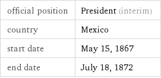
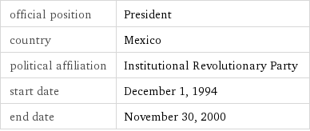

# Mexico Least You Need To Know
## People
### Father Miguel Hidalgo
 - Priest and rebellion leader
 - Started the Mexican War of Independence
### Benito Juarez (Lincoln of Mexico)

 - Liberal party
 - Known as the "Lincoln of Mexico" for similar social beliefs with Abraham Lincoln
### Felipe Calderon

 - Won against Andres Manuel Lopez Obrador by 1% of the votes
 - The election was claimed to be fraud by many protestors
### Vicente Fox

 - President of Mexico, the first elected from an opposition party since 1910, and first to defeat the Institutional Revolutionary Party (PRI) in 71 years
### Cuahtemoc Cardenas
 - NDF party member
 - Lost the presidential election in 1989 to Carlos Salinas (PRI)
 - The elections were fraudulent
### Lazaro Cardenas (Roosevelt of Mexico)

- Nationalized the oil industry in 1938
- Created of Pemex, the government oil company
- Redristributed land to small holders in collective holdings (ejidos)
- Economic liberalization
### Porfirio Diaz

 - Served 7 terms as president
 - Veteran of the War of Reform and the French intervention in Mexico
 - Overthrew Emperor Maximillian in a coup in 1876
 - Ruled with a group of technocrats known as *Cientificos* for 35 years.
 - His period of rule is known as the *Porifiriato*
### Andres Manuel Lopez Obrador (AMLO)

 - Current president of Mexico
 - Switched from the PRI to the PRD in 1989
 - Currently in the National Regeneration Movement party
 - Rejected the election results of 2006 and 2012
 - Caused slight factionalism in the PRD
### Pancho Villa
 - General who became one of the leading figures in the Mexican Revolution
 - Assassinated after becoming re-involved in Mexican politics
 - He is hearlded as a hero of the revolution.
### Santa Anna

 - Santa Anna was a major player in Mexico's independence
 - He was one of Mexico's earliest caudillos
### Emiliano Zapata
 - Military leader and revolutionary who is considered a key figure in the Mexican Revolution
 - Formed and led the Liberation Army of the South
 - Followers became known as Zapatistas
### Ernesto Zedilla

 - The last president in a long 71-year line of PRI presidents
 - Economic crisis during presidency
 - Neoliberal policies
### Comandante Marcos
 - Former military leader and spokesperson of the Zapatista Army of National Liberization (EZLN) during the Chiapas conflict
### Plutarco Calles

 - 	National Revolutionary Party (PRI)
 - Redistribution of land and equality
 - State atheism, which led to the Cristeros Rebellion.
### Luis Donaldo Colosio
 - PRI candidate in the election of 1994
 - Assassinated at a campaign rally in Tijuana
## History
### Mexico’s War of Independence
 - Lead by Father Hidalgo, it lasted from 1810 to 1821
 - It ended when Spain recognized Mexico's independence
 - Military rule and instability followed until the late 20th century
### Mexican American War
 - Lasted from 1846 - 1848
 - Helped fufil the United States' "manifest destiny" goal to expand its territory across the enitre North American continent
 - The treaty of Guadalupe Hidalgo ended the war in America's favor. The treaty gave the U.S. an additional 525,000 square miles of land
### Porfiriato
 - Porfirio Diaz ruled from 1876 to 1911
 - Authoritarian
 - Cientificos ruled with Diaz
 - Economic growth from entrepreneurship and foreign investment in the U.S.
 - Rich and poor gap grew
 - Ended with a coup from the elite
### Mexican Revolution
 - The Mexican revolution lasted from 1910 to 1921 and overthrew Porfirio Diaz, ending his authoritarian rule and establishing a democracy in 1917
### Cristeros Rebellion
 - Lasted from 1926 - 1929
 - A rebellion in response to Plutarco Calles' secularzation and state atheism
 - He sought to eliminate to power of the church
 - The church fought with Cristero fighters supported by the U.S.
 - Ended in a ceasefire
### Establishment of PRI
- The Institutional Revolutionary Party (PRI) was founded in 1929 to legitimize the Mexican Revolution
### Tlatelolco Massacre (1968)
 - A student protest that resulted in the massacre of 200 people by the Mexican military.
 - Using co-optation, the president who ruled after the Tlatelolco Massacre enlisted student activists in his administration
### Zapatista Uprising/Chiapas Rebellion
 - Poor social conditions among Amerindians led to the Chiapas Rebellion, which was led by the Zapatistas (EZLN)
 - Began in 1994
 - Vicente Fox made some (not very effective) efforts to include Zapatistas into the political system
 - The rebellion is not formally called off
## System of Government
### Federal Republic
 - A federal system with a republican government
### Federal District of Mexico City
 - Most populated city in North America
 - Captital of Mexico
 - Has an elected head of government and a greater political autonomy than other regions
### One Party Dominant State
 - A state in which one party dominates the political system. The most similar thing in Mexico is the PRI.
### Caciques
 - Native chiefs in Mexico
### Caudillos
 - Political and military strongmen from different areas of the country
## Legitimacy
### Revolution of 1910-1911
 - Overthrew the current government and changed it drastically because there was no solution to a power transfer
 - Coup by the elite
 - The *Porifiriato* ended with Porfirio Diaz's exile to france in 1911
 - Mexico admires and honors revolutionary heroes
### Constitution of 1917
 - Set up a democratic government after the Mexican Revolution
 - Similar to the U.S.
 - Three branches
## Cleavages
### Urban v. Rural
 - 75% urban
 - PRI and caudillos controlled peasants for small favors.
### Ethnic
### Mestizo v Amerindian
 - The Amerindian are the indigenous people of Mexico
 - Mestizo are a mix of Spanish colonists and Mexican natives
 - Mexico is 60% Mestizo, but the south is primarily Amerindian
### Social Class
 - High economic inequality
 - A lot of middle class income comes from the informal economy
 - Middle class and upper class citizens are more likely to vote
### North vs South
 - The North is more prosperous due to trade with the U.S.
 - South is largely Amerindian and more isolated from Urban influence and the U.S.
## Economic Policy
### Dependency Theory
 - Mexico's resources flow into the US and enrich it because of the "world system"
### Import Substitution
 - A strategy of state led development where the state protects domestic goods and owns large industries.
 - Largely implemented during Lazaro Cardenas' rule
### Maquiladoras
 - Manufaturing zones in Northern Mexico that mainly produce goods for the U.S.
 - First appeared in the 1960s
### “Mexican Miracle”
 - The rapid growth in the late 20th century of Mexico's GNP following its transition from an authoritarian regime to a democratic regime.
 - Based largely of neoliberalism, oil, and natural gas
### NAFTA
 - An agreement between Mexico, Canada, and the U.S. to increase free trade between the countires
### Neoliberalism
 - Strategy that calls for free markets, balanced budgets, privitization, free trade, and and limited government involvment in the economy.
 - Practiced in the early 1980s
### Parastatals
 - Government organizations that are semiautonomous
 - Mexico had a large parastatal newtork under PRI
### PEMEX
 - Large government owned oil company
### Pendulum Theory
 - The observation that Mexico has been swinging from socialist policies to economic liberalization

 - The pendulum stopped in the early 1970s with the emergence of the technicos
### PPP
 - Measure of the cost of living in a country
 - $17,900/yr
### Haciendas
 - Large estates that existed during the colonial period of Mexico
### Ejidos
 - Collective land grants given to peasants during Lazaro Cardenas' rule
### Latifundia
 - Large estates that existed in ancient Rome and in modern day Latin America
### Informal sector
 - Businesses that are not registered with the government.
### GINI Index
 - 0.47, high inequality
### HDI
 - High literacy rate in men and women (~ 95 %)
 - Decent life expectency (~ 76 years)
## Government Institutions
### President
#### Dedazo
 -  A method used by the PRI to select candidates for office
#### Sexenio
 - Six year presidential term. Each president could only serve one term.
 - Stabilized conflicts between political figures
### Legislature
 - Bicameral
 - Direct elections
#### Senate
 - 128 members
 - 6 year terms
 - 3 senators are elected from each of Mexico's 31 states
 - The remaining senators are chosen by proportional representation
#### Chamber of Deputies
 - 500 members
 - 3 year terms
 - Includes 300 deputies elected from single member districts and 200 members elected by proportional representation
### Judiciary
#### Judicial Reforms (Zedillo + Ongoing)
 - Emphasis on rule of law
 - Increased human rights interests
 - Media exerted pressure of the judiciary to do its job
 - Zedillo refused to interfere with court rulings
 - Vicente Fox made dissapointing efforts to create an independent judiciary
#### Inquisitional vs Adversarial
 - An inquisitorial system is a legal system where the court is actively involved in investigating the facts of the case
 - An adversarial system is a legal system where the role of the court is an impartial referee.
## Political Parties
### PRI (Institutional Revolutionary Party)
 - Party established to legitimize the Mexican Revolution.
 - In power for 71 years straight (1920 - 2000)
 - Formed as a coalition of elites
 - Appeals to the less educated and rural population
#### Platforms
 - Corporatism
 - Patron-clientelism
#### Key Players
 - Lazaro Cardenas
 - Emiliano Zapata
### PRD (Democratic Revolutionary Party)
 - Opposition to the left of the PRI
 - Appeals to younger, poltically active voters
#### Platforms
 - Equality
 - Social justice
#### Key Players
 - Cuahtemoc Cardenas
 - Lopez Obrador
 - Andres Manuel
### PAN (National Action Party)
 - Opposition to the right of the PRI
 - Represents business interests
 - Strong in the North because of foreign trade n' stuff
#### Platforms
 - Regional Autonomy
 - Less government intervention in the economy
 - Clean and fair elections
 - Good rapport with the Catholic Church
 - Support for private and religious education
#### Key Players
 - Felipe Calderon
 - Vicene Fox
 - Ernesto Zedilla
 - Plutarco Calles
## Elections
### Electoral Reforms
 - Competitve clean elections developed
### Mixed electoral system
 - Some congressmen are elected by proportional, some are elected by single member districs
 - IFE reforms
### Federal Electoral Institute (IFE)
 - An idependent body that regulates free and competitve elections
#### Reforms
 - Campaign finance restrictions
 - Critical media coverage
 - International watch teams
 - Election monitoring
### 2000 Election
 - Vicente Fox entered the presidency
 - PAN almost had a house majority over PRI
### 2006 Election
 - Calderon (PAN) v. Obrador (PRD)
 - Calderon won by .5 % of the votes
 - Obrador called for a recount, the results did not change
 - Obrador claimed the election was "stolen" from him
## Civil Society
### Co-optation
 - A process used by the Mexican government to include citizen demands in the policymaking process
 - Commonly used when citizen demands get out of hand
### State Corporatism
 - The state listens to certain interest groups it likes
 - Found in small magnitudes during Lazaro Cardenas' rule
### Patron-Client System
#### camarillas
 - Patron-clientel systems that run through the government and independent organizations
 - Causes corruption
## Policy
### Bracero Program
 - Initiated in 1942
 - Garunteed secure living conditions and a minimum wage
 - Imported contract laborers from Guam
### Immigration Reform and Control Act (1986)
 - United states law enacted during Reagan's presidency
 - Required employers to attest to their employees' immigration status
 - Made it illegal to hire or recruit illegal immigrants knowingly
 - Legalized certain seasonal agricultural undocumented immigrants, and
 - legalized undocumented immigrants who entered the United States before January 1, 1982 and possessed at least a minimal knowledge about U.S. history, government, and the English language.
### Immigration Policy
 - Vicente Fox proposed guest worker programs and amnesty for illegal immigrants
 - He proposed a more free border
 - The 9/11 attacks made the U.S. hike their border security, dissolving any hopes of a free border
### Drug Trafficking
 - Causes corruption in Mexico's government through camarillas
 - Felipe Calderon stepped up the war on drugs
 - He sent troops to dispel gangs
 - The immediate reaction was a murder spike (especially on police)
 - Calderon responded by sending thousands of military soldiers to patrol the streets
 - Lots of violence and assassinations followed
 - In 2011, the U.S. sent C.I.A. agents to a Mexican base to try and aide in the drug crisis
## Other
### Technicos
 - Educated business oriented leaders
 - Emerged after Pendulum Theory stopped and took control of the government
 - Free market politics
### Zapatista Army of National Liberation (EZLN)
 - A military organization of Zapatistas that rose during the turmoil of the Chiapas Rebellion against the NAFTA agreement
### Televisa
 - Number one wireless company in Mexico, over 70 % of the population uses it
 - Controls the broadcast television market
<!--stackedit_data:
eyJoaXN0b3J5IjpbMTY0NTgxMzE1NF19
-->