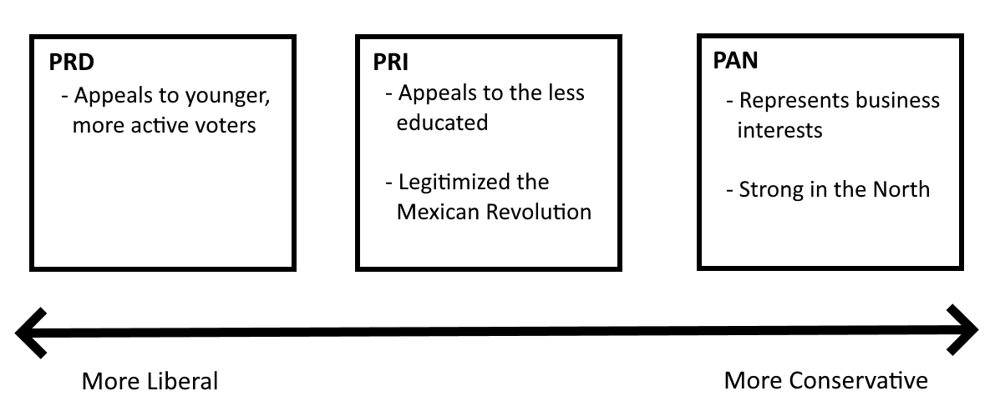

# Mexico Sheet
## SAP
### Regime
 - Originally Authoritarian (Spanish rule and Porifiriato)
 - Democratic regime with the constitution of 1917
### Co-optation
 - A process used by the Mexican government to include citizen demands in the policymaking process
 - Using co-optation, the president who ruled after the Tlatelolco Massacre enlisted student activists in his administration
## P & E Change
 - Early history of revolutions (Revolution of 1910)
 - Overthrew Porfirio Diaz and established democracy
 - **Pendulum Theory** --- Swinging between market economy and socialism

 - The pendulum stopped in the early 1970s with the emergence of the technicos
## Social and Economic Cleavages
## Political
### Federalist v. Unitary
### Globalism
 - Mexico is a federalist state with 31 states and Mexico City as a capital

 - The North favors foreign investment and Western influence.
 - Maquilladores on the border produce goods for American consumers
### Linkage Institutions
#### PRI (Institutional Revolutionary Party)
 - Party established to legitimize the Mexican Revolution.
 - In power for 71 years straight (1920 - 2000)
 - Formed as a coalition of elites
 - Appeals to the less educated and rural population
#### PRD (Democratic Revolutionary Party)
 - Opposition to the left of the PRI
 - Appeals to younger, poltically active voters
#### PAN (National Action Party)
 - Opposition to the right of the PRI
 - Represents business interests
 - Strong in the North because of foreign trade n’ stuff

## National Government
### Legislature
 - Bicameral
 - Direct elections
#### Senate
 - 128 members
 - 6 year terms
 - 3 senators are elected from each of Mexico's 31 states
 - The remaining senators are chosen by proportional representation
#### Chamber of Deputies
 - 500 members
 - 3 year terms
 - Includes 300 deputies elected from single member districts and 200 members elected by proportional representation
### Executive
 - Directly elected by winner takes all system
### Judicial
 - No judicial review in practice
 - Constitution provides for it
### Constitutionalism
 - Constitution of 1917 established after the Porifiriato period
 - The constitution established a federal democracy with three branches
