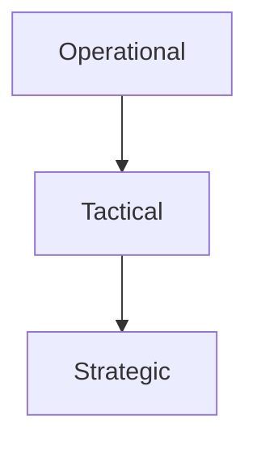

# 9/20 Notes IB Business

## Vision
 - Ideal goal for the future

## Mission
- Clear purpose
- States the grounded purpose of the business

>Example Statement: "To inspire and nurture the human spirit, one cup, one neighborhood at a time" (Starbucks)

## Comparisons
Vision  | Mission
--|--
Very long term|Medium to long term  
Barely updated | Updated more often
Outlines what could be | Realizes targets
No targets | Outlines the values of the business

## Aims & Objectives
### Aims
 - Long term goals of the business
 - Vision statement summarizes this

### Objectives
 - Medium short term goals based on aims
 - 3 types

#### Operational
 - Set by managers

#### Tactical
 - Set by middle managers
 - Strategic

#### Strategic
 - Set by senior manager
 - Aims

### SMART Aims
 - **S**pecific
 - **M**easureable
 - **A**chievable
 - **R**elevant
 - **T**imely

### Changing Objectives
 - Businesses are constantly changing
 - They must adapt or die

### Changing Environments

#### External
 - Social
 - Technical
 - Economic
 - Ethical
 - Political
 - Legal
 - Ecological

#### Internal
 - HR
 - Fin
 - OM
 - Mktg

### Ethical Objectives
 - Goals based on establishing codes of behavior.

#### Examples
 - Building loyalty
 - \+ Image
 - \+ Work environment
 - Less risk of legal redress
 - Satisfying customer expectation
 - More profits

### Corporate Social Responsibility
 - Acting in ethical manners towards all stakeholders

#### Free Market
 - Society will take care of it

#### Altruistic

#### [Redacted]

## SWOT Analysis
 - Stands for "Strengths, Weaknesses, Opportunities, and Threat"
 - S and W are internal
 - O and T are external

## Kidzplay Bouncy Castles
### Opportunities
 - Limited competition
### Weaknesses
 - Limited business on it's newly launched website
### Strengths

### Threats
 - Weak demand in winter
 - Highly profitable earnings which attract competition
