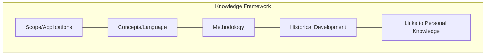

# ToK Notes 9/27

## Knowledge Framework

```mermaid
graph TB
subgraph "Knowledge Framework"
a[Scope/Applications] --- b[Concepts/Language]
b --- c[Methodology]
c --- d[Historical Development]
d --- e[Links to Personal Knowledge]
end
```
